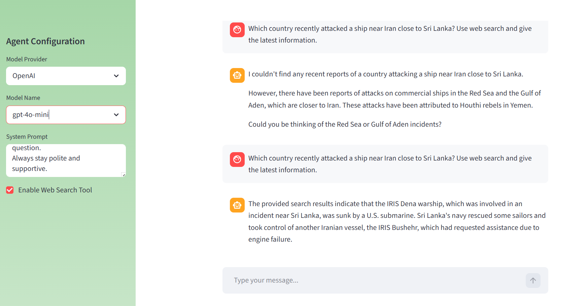

# End-to-End AI Agent Chatbot

A Modular AI chatbot built with **FastAPI** (Backend), **Streamlit** (Frontend), and **langchain** (AI Orchestration). This project supports switching between LLM providers (Groq/OpenAI/Google) and includes a web-search tool for real-time information.

## 🚀 Features
- **Multi-Model Support:** Switch between Groq (Llama 3) and OpenAI (GPT-4o mini).
- **Web Search Integration:** Uses Tavly API for real-time information retrieval.
- **Modular Architecture:** Clean separation between AI logic, API routing, and UI.
- **Interactive UI:** Dynamic sidebar for model configuration and system prompt customization.

---

## 🛠️ Tech Stack
- **Frameworks:** FastAPI,LangChain
- **Frontend:** Streamlit
- **LLM Providers:** Groq, OpenAI,Google
- **Search Tool:** Tavly AI

---
##  🧪 Chatbot Demo — Without Web Search vs With Web Search



## 📁 Project Structure
```text
├── agents/
│   ├── llm_provider.py    # LLM initialization logic
│   ├── tools.py           # Search tool configuration
│   └── ai_agents.py       # Agent logic
├── app/
│   ├── config.py          # API key & environment management
│   ├── models.py          # Pydantic schemas for data validation
│   └── route.py           # FastAPI chat endpoints
├── front_end/
│   └── app.py             # Streamlit interface
├── main.py                # Backend entry point (Uvicorn)
├── requirements.txt       # Dependencies
└── .env                   # API Keys (GitIgnored)


